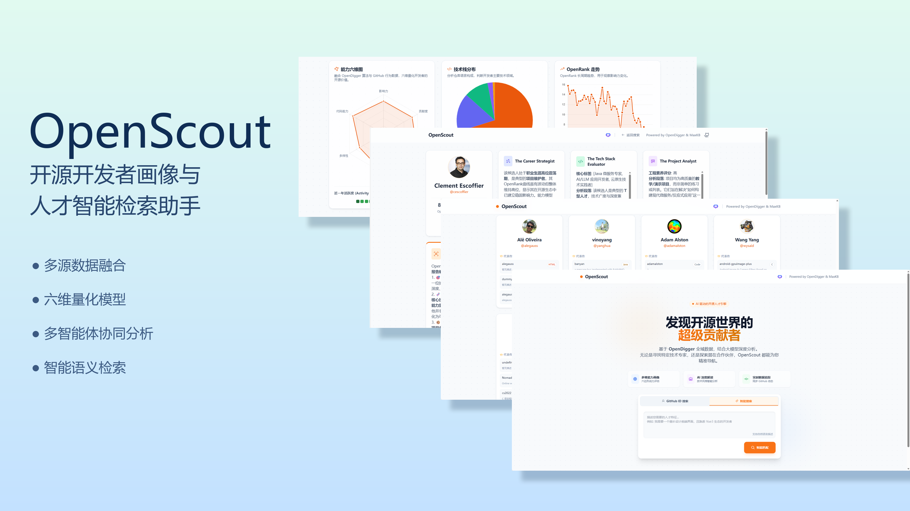
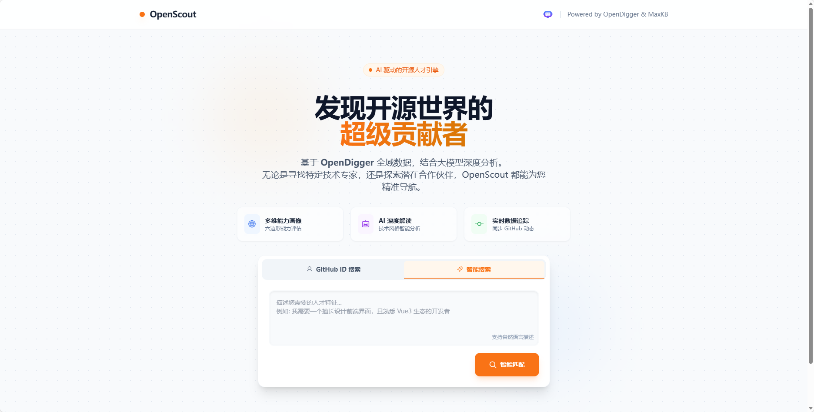
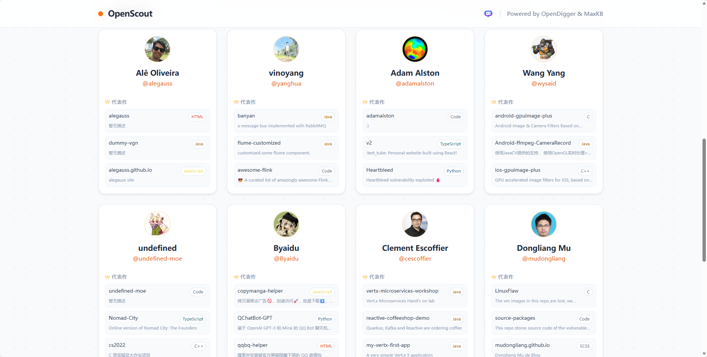
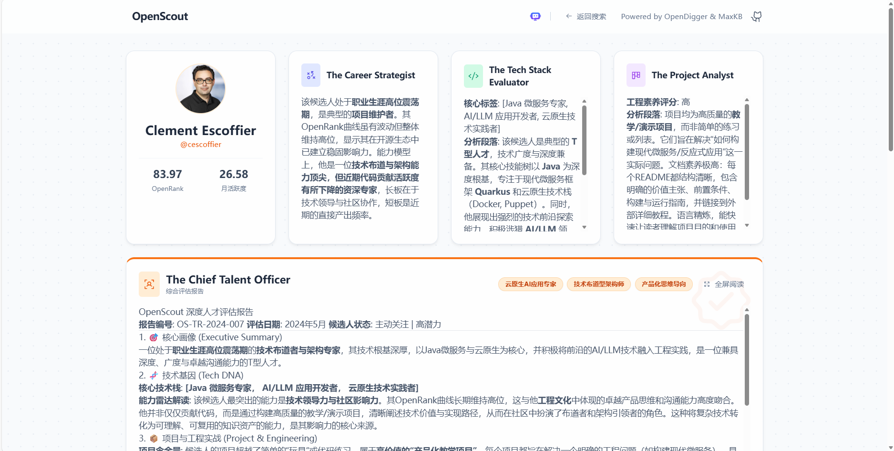
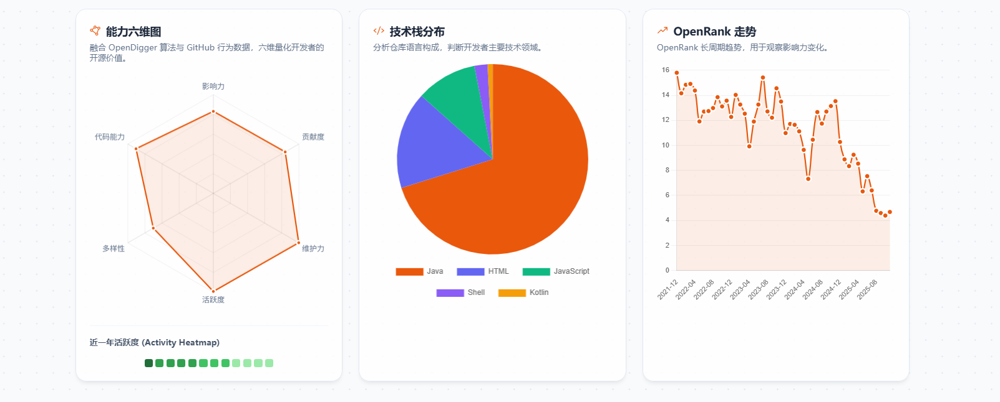
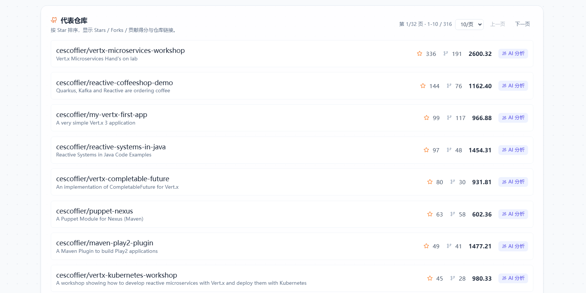
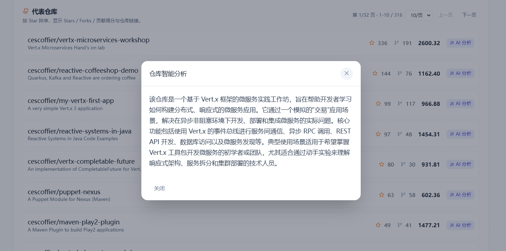

[](https://www.python.org/)
[](LICENSE)

**English** | [中文](README_CN.MD)

# OpenScout



## Table of Contents
- [Overview](#overview)
- [Key Features](#key-features)
  - [1. Semantic Search (Smart Search)](#1-semantic-search-smart-search)
  - [2. MaxKB Multi-Agent Analysis Pipeline](#2-maxkb-multi-agent-analysis-pipeline)
  - [3. 6-Dimension Capability Radar](#3-6-dimension-capability-radar)
  - [4. Intelligent Repository Analysis](#4-intelligent-repository-analysis)
- [Architecture](#architecture)
- [Installation](#installation)
- [MaxKB Agent Configuration](#maxkb-agent-configuration)
- [Team](#team)

---

## Overview

**OpenScout** is an intelligent system focused on in-depth GitHub developer profiling and technical capability assessment. By combining GitHub APIs, OpenDigger ecosystem data, and multi-dimensional scoring models, OpenScout automatically builds a comprehensive technical profile and quantifies capability across six dimensions: influence, contribution, maintainership, engagement, diversity, and code capability.

The project adopts a **multi-agent collaborative** data collection and analysis workflow, aiming to help open-source communities, companies, and recruiters identify high-quality talent, while providing developers with an objective and structured technical impact report.



---

## Key Features

### 1. Semantic Search (Smart Search)

OpenScout supports both exact lookup by ID and a built-in **semantic search engine**. It generates high-dimensional vector embeddings for each developer’s tech stack, project descriptions, and README content, enabling natural-language fuzzy matching.

- **Natural language queries**: Search with prompts like “Find a backend engineer skilled in Rust and high-performance networking” or “Looking for a React frontend expert”.
- **Built-in vector store**: A lightweight persistent vector index (`vector_store.json`) supports incremental updates; the index is automatically built on first run.
- **Hybrid feature extraction**: Ranking considers language preferences, GitHub topics, and README content of representative repositories.



### 2. MaxKB Multi-Agent Analysis Pipeline
#### Agent Responsibilities (Overview)

- #### **The Career Strategist**: Uses profile, 6-dim radar, and OpenRank/activity trends to infer career stage (rising/stable/dormant) and ecosystem role (Maintainer/Core/Casual), producing a conclusion-driven persona

- #### **The Tech Stack Evaluator**: Uses language distribution and topics to identify core tech stack (excluding auxiliary languages), assess breadth (I-shaped/T-shaped), and evaluate modernity and technical taste

- #### **The Project Analyst**: Uses top repo descriptions/README to evaluate project seriousness (toy/practice/resources/production), documentation and engineering maturity (install, architecture, tests, badges), and communication clarity

- #### **Chief Talent Officer**: Synthesizes the above agent outputs into a structured “OpenScout Talent Assessment Report”, including persona, technical DNA, and practical engineering evidence

- #### **Keywords Generator**: Generates 3 concise keywords from the report: `tech_core` / `career_persona` / `engineering_trait`


### Report Example



### 3. 6-Dimension Capability Radar

OpenScout scores developers across six dimensions (50–100). Raw metrics are normalized via $\ln(x+1)$ and mapped into the 50–100 range using a CDF transform.

$$
\text{Score}_{\text{final}} = 50 + 50 \cdot \Phi \left( \frac{\ln(S_{\text{raw}} + 1) - \mu}{\sigma} \right)
$$

The six dimensions are:

#### 1. Influence

$$S_{\text{inf}} = \underbrace{\color{#e3b341}{0.6 \cdot \text{Stars}}}_{\text{recognition}} + \underbrace{0.4 \cdot (\color{#3fb950}{\text{Forks}} + \color{#f85149}{\text{Issues}})}_{\text{spread and feedback}}$$

*Measures community visibility and breadth of attention.*

---

#### 2. Contribution

$$S_{\text{con}} = \underbrace{\color{#238636}{0.7 \cdot \text{PRs}_{\text{merged}}}}_{\text{features delivered}} + \underbrace{\color{#8957e5}{0.3 \cdot \text{Issues}_{\text{created}}}}_{\text{problem discovery}}$$

*Measures concrete output and ecosystem building.*

---

#### 3. Maintainership

$$S_{\text{main}} = \underbrace{\color{#0969da}{0.7 \cdot \text{Merged Others' PRs}}}_{\text{decision power}} + \underbrace{\color{#1a7f37}{0.3 \cdot \text{Review Comments}}}_{\text{quality control}}$$

*Represents responsibility and activity as a maintainer/lead.*

---

#### 4. Engagement

$$S_{\text{eng}} = \underbrace{\color{#0969da}{0.6 \cdot \text{Comments}_{\text{issue}}}}_{\text{community discussion}} + \underbrace{\color{#1a7f37}{0.4 \cdot \text{Comments}_{\text{review}}}}_{\text{technical depth}}$$

*Measures collaboration and participation in community conversations.*

---

#### 5. Diversity

$$S_{\text{div}} = \underbrace{\color{#0969da}{0.6 \cdot \text{Languages}}}_{\text{skill breadth}} + \underbrace{\color{#dd7ad2}{0.4 \cdot \text{Topics}}}_{\text{domain breadth}}$$

*Evaluates boundaries of knowledge via stack variety and project domains.*

---

#### 6. Code Capability

$$S_{\text{code}} = \sum_{PR \in \text{Merged}} \underbrace{\ln(\text{Repo Stars} + 1)}_{\text{project value weight}}$$

*A log-weighted proxy for “code contributions in high-value projects”.*

---

### Radar / Trends / Tech Stack Example



### 4. Intelligent Repository Analysis

On the developer profile page, each “Representative Repository” supports LLM-based automated summarization. The system fetches `README.md`, repository description, and topics from the repo URL, then calls the LLM to produce a concise summary with streaming output.

#### Example



#### Analysis Example



---

## Architecture

OpenScout provides an end-to-end pipeline covering “data collection → metric modeling → intelligent analysis → visualization”, composed of four layers:

- **Data Layer (GitHub / OpenDigger)**: Developer events, repository metadata, and macro ecosystem metrics (OpenRank, Activity, etc.).
- **Pipeline Layer (Collection & Modeling)**: Located in `src/`, runs incremental scripts and writes structured outputs to `data/`. Includes embedding generation for retrieval.
- **Service Layer (Backend API)**: `server.py` provides unified APIs (data query + streaming AI responses), hosts static assets (`/images`), and handles background mining tasks.
- **Analysis Layer (AI Agents)**:
  - **MaxKB Multi-Agent**: Deep analysis from structured inputs (career persona / tech stack evaluation / project auditing).
  - **LLM**:
    - **Search Embedding**: Uses `qwen3-text-embedding-v4` to generate developer embeddings.
    - **Repo Summary**: Streams real-time summaries for a single repository.

### Frontend Stack

- `search.htm` / `profile.htm`: Lightweight vanilla HTML + JS (no build tools).
- **Tailwind CSS**: Utility-first styling.
- **Chart.js**: High-performance visualization (radar, trends, stack distributions).
- **Marked.js**: Markdown rendering on the client (AI reports and repo summaries).

### Backend Stack

- **FastAPI**: High-performance Python web framework (async streaming, background tasks).
- **OpenDigger API**: Macro ecosystem analytics (OpenRank, Activity).
- **GitHub API**: Core data source (profiles, repos, events).
- **Qwen API**: Embedding service and streaming LLM inference (repo analysis, semantic search).
- **MaxKB API**: Multi-agent orchestration.
- `config.json`: Unified configuration (tokens, model parameters).

### Directory Structure

```
OpenScout/
├── data/                       # Data storage
│   ├── raw_users/              # Per-user raw JSON outputs
│   ├── macro_data/             # Cached OpenDigger macro metrics
│   ├── users_list.json         # Target user list
│   ├── radar_scores.json       # Final radar scores
│   └── vector_store.json       # Developer embedding index for semantic search
├── src/                        # Core pipeline scripts
│   ├── get_user_name.py              # [Scout] User discovery
│   ├── get_user_info.py              # [Metric] OpenDigger data fetch
│   ├── get_all_metrics.py            # [Metric] Full metrics fetch
│   ├── calculate_radar.py            # [Analysis] Radar scoring
│   ├── fetch_representative_repos.py # [Context] Representative repos fetch
│   ├── fetch_tech_stack_context.py   # [Context] Tech stack context extraction
│   └── run_pipeline.py               # [Orchestrator] Pipeline entrypoint
├── image/                      # Images (icons, screenshots)
├── search.htm                  # [Frontend] Search/home page
├── profile.htm                 # [Frontend] Developer profile page
├── server.py                   # [Backend] FastAPI server
├── config.json                 # Config (tokens, keys)
├── OpenScout.mk                # [MaxKB] Multi-agent export package
├── Intro2MaxKB.md              # [MaxKB] Setup doc
├── requirements.txt            # Dependencies
└── README.md                   # Documentation
```

---

## Installation

### Requirements
- Python 3.8+
- Recommended: virtual environment (venv / conda)

### 1. Install dependencies
```bash
pip install -r requirements.txt
```

### 2. Configuration (GitHub / MaxKB / LLM)
Create/edit `config.json` in the project root:

```json
{
  "github_token": "YOUR_GITHUB_TOKEN_HERE",
  "maxkb_api_url": "http://your-maxkb-host:8080/chat/api/YOUR_APPLICATION_ID",
  "maxkb_api_key": "application-YOUR_MAXKB_KEY",
  "LLM_api_url": "https://dashscope.aliyuncs.com/compatible-mode/v1",
  "LLM_api_key": "sk-YOUR_DEEPSEEK_KEY",
  "LLM_embedding_model": "text-embedding-v4"
}
```

### 3. Run the data pipeline ([pipeline docs](./src/README.md))

#### Option A: One-click full pipeline (recommended)
```bash
python src/run_pipeline.py
```

This will run, in order:
1. User discovery (`get_user_name`)
2. OpenDigger macro data (`get_user_info`)
3. Full metric collection (`get_all_metrics`)
4. Radar scoring (`calculate_radar`)
5. Context enrichment (`fetch_tech_stack_context`, `fetch_representative_repos`)

#### Option B: Run step by step

**Step 1: Build user list**
```bash
python src/get_user_name.py
```
> Output: `data/users_list.json`

**Step 2: Fetch OpenDigger macro data**
```bash
python src/get_user_info.py
```
> Output: `data/macro_data/macro_data_results.json`

**Step 3: Fetch full raw metrics**
```bash
python src/get_all_metrics.py
```
> Output: `data/raw_users/<username>/*.json`

**Step 4: Compute radar scores**
```bash
python src/calculate_radar.py
```
> Output: `data/radar_scores.json`

**Step 5: Fetch extra context (optional)**
```bash
python src/fetch_tech_stack_context.py
python src/fetch_representative_repos.py
```

### 4. Start the server

```bash
python server.py
```

Then open `http://localhost:8001`. On the first semantic search, the backend may build embeddings for existing users in the background, which can take a few minutes.

---

## MaxKB Agent Configuration

MaxKB deployment, import, and integration:

- Import `OpenScout.mk` into MaxKB
- Bind available models to each Agent and publish
- Configure `config.json` with `maxkb_api_url` / `maxkb_api_key`, then trigger analysis from the frontend

---

## Team
- Leader: [@Luli3220 杨子炫](https://github.com/Luli3220) — Semantic search, MaxKB orchestration & configuration, data mining, backend, report writing + PPT
- Member: [@pck-altra 潘淳恺](https://github.com/pck-altra) — Frontend development, client-server integration, data mining, video recording, PPT

---

## License
[MIT License](LICENSE)
